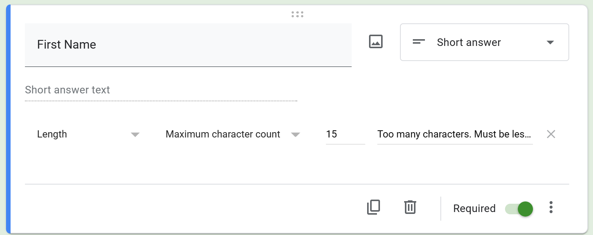
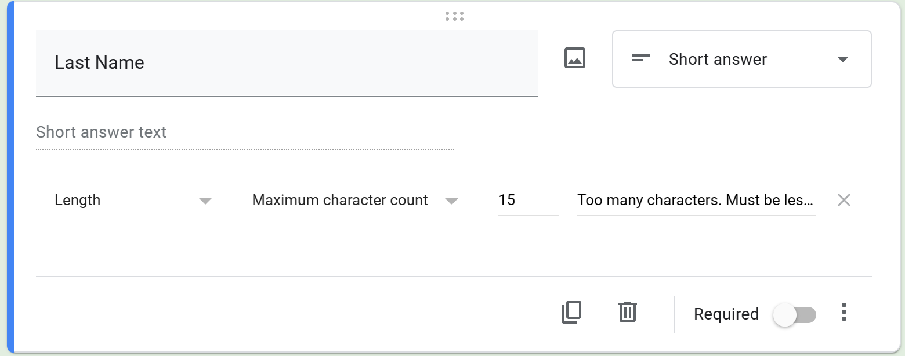
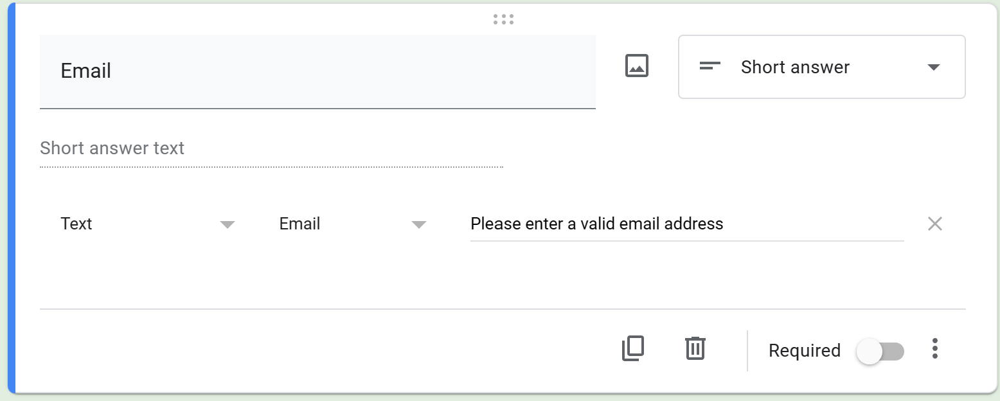
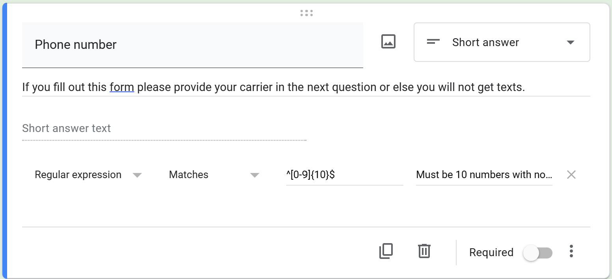
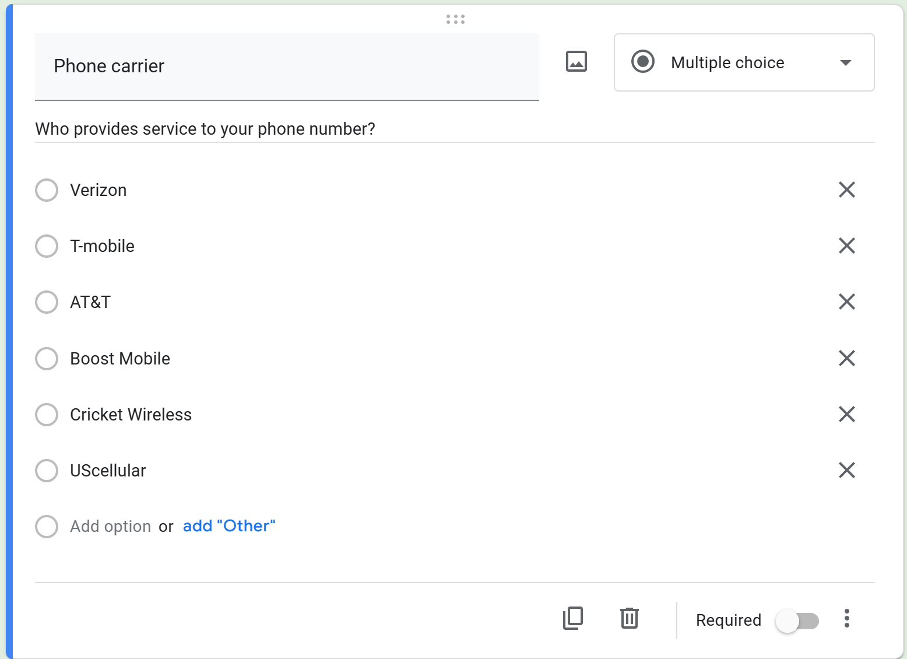
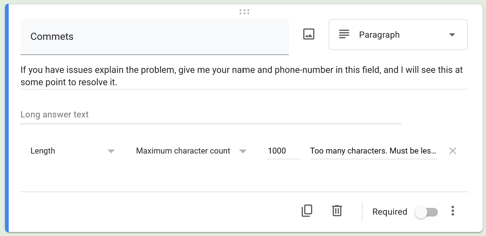
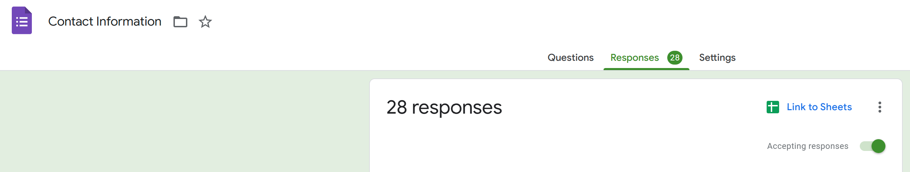
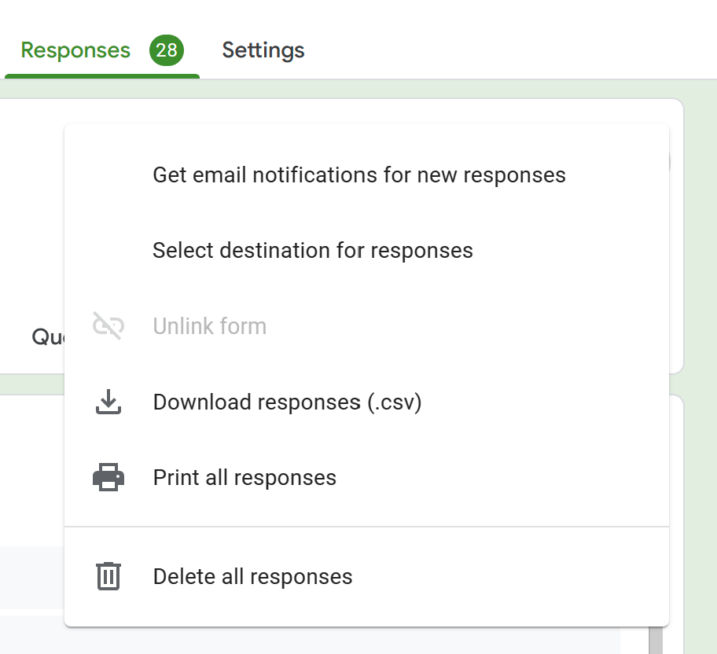

# Overview

* To run this software all you need from this github repository is the FreeEmailer.exe
### Using the Program
- [Using the executable](https://youtu.be/N7Otm2caGtg)

## Setting up the rest of the things you will need
You have to create a new Google Account, and use it to open a Gmail Account, this account will be used to manage everything.

Because it's a new account you can transfer access over to someone else without worry.

You will be using this google account to monitor the gmail inbox, and the google form.

## Creating a new Google Account
To create a Google account, you need to follow these steps:

1. Go to the [Google account creation page](https://accounts.google.com/signup)
2. Enter your first and last name, your preferred username, and a strong password. You can also choose to use your current email address instead of creating a new one.
3. Click on Next and verify your phone number by entering the code that Google sends you via text message or voice call.
4. Click on Next and provide some personal information, such as your birthday and gender. You can also choose to add a recovery email address and a photo to your account.
5. Review the terms of service and privacy policy and click on I agree to accept them.
6. Congratulations, you have created your Google account! You can now access various Google services, such as Gmail, YouTube, Drive, and more.
## Creating a Gmail Account
To set up Gmail on your Google account, follow these steps:

1. Go to [Gmail](https://mail.google.com) and sign in with your Google account credentials.
2. If you don't have a Google account, click on Create account and follow the instructions.
3. Once you are signed in, you will see your inbox and other Gmail features.
4. You can customize your Gmail settings by clicking on the gear icon in the top right corner and choosing See all settings.
5. You can also add other email accounts to your Gmail by clicking on Accounts and Import and then Add a mail account.
6. Enjoy using Gmail on your Google account!
## Enabling Two Factor Authentication
To enable two factor authentication for your Google account, follow these steps:

1. Go to your Google Account.
2. Select Security.
3. Under "Signing in to Google," select 2-Step Verification. You might need to sign in.
4. Follow the on-screen steps.
## Getting a passkey for the Google Account to input into the program
To generate an app passcode for your Google account, follow these steps:

1. Go to your Google Account.
2. Select Security.
3. Under "Signing in to Google," select App Passwords. You may need to sign in.
4. At the bottom, choose Select app and choose the app you’re using.
5. Choose Select device and choose the device you’re using.
6. Select Generate.
7. Follow the instructions to enter the app passcode.
8. Select Done.
## Creating the Google Form
* Here is a template for the google form if you don't want to make it yourself (may break so tutorial on how to make is provided below): [Link to a Copy of the Form](https://docs.google.com/forms/u/0/d/1oWTTLdqrDoWX8sIywNU9nzkXgOAAiPtrRqR6J68kRaw/copy)
 

* Example of what the form should look like:
   [Google Form Example](https://docs.google.com/forms/u/0/d/1sgh6TgXYl5S0LR8_JTM7DjhhXYwfDIwVLTmbQO43w_Y/)

## How to set up the google form questions on your own

### First question on form

### Second question on form

### Third question on form

### Fourth question on form

### Fifth question on form

### Sixth question on form

## Getting the CSV file from the Google Form
### Go to the Responses part of your google form and click the three dots.

### Click on download responses, and then choose a place to put it on your system.

## Making the QR Code
To make a QR code, you can follow these steps:

1. [QR Code Creation Website](https://www.qrcode-tiger.com/?type=googleForm)
2. Enter the link / website URL to your google form.
3. Customize the design of your QR code if you want, or leave it as is.
4. Download your QR code.
## Using the Program
- [Using the executable](https://youtu.be/N7Otm2caGtg)
## Useful Tips

- You should create a text file so you can copy, and paste the information into the program without having to go find it. You could even password protect the file so nobody can gain access without it.
- You can easily update your CSV File, by downloading the latest version from the google forms page that you created. 