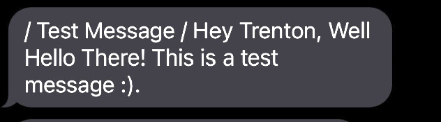

# Overview
* This software was build to be able to send out text messages, and emails for free.

* This software can be used to connect communities, and their members easily! 
### This software lets you send emails, and texts out for free.
* ####  All you need to run this program is the FreeEmailer.exe application file, nothing else is needed to run this software

I wrote this software because you can't find a solution to this problem usually, unless you pay lots of money to someone who provides the service,
and so I set out to make a open source tool to do it for free.

Services like this are usually called CRM's, which stands for Customer relationship management.
CRM software is used by companies around the world to have the capability to send facilitate communications between the company, and it's customers.

My software aims to provide a solution for small communities, and small businesses who lack the resources required to utilize CRM business solutions. 
 

Here is a guide on how to set up the things required to get this application working: [How To Setup](HowToSetUp.md)

* [Software Demo Video](https://youtu.be/bLHm1sH-2ds)

# Development Environment

I used Visual Studio Code to build this project, and Visual Studio to use Nukita.

I used Python as the development language.

I used two python libraries: smtplib, csv

In order to package it into a .exe I used Nukita which cross compiles your app into C++ then compiles that to create a signed *.exe binary.

# Useful Websites

- [Nukita Github](https://github.com/Nuitka/Nuitka)
- [Google Forms](https://docs.google.com/forms)

## Example Messages

